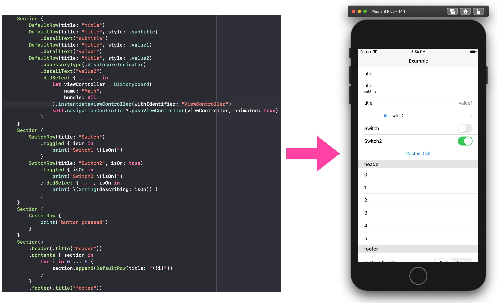

# TableViewContent

[](https://cocoapods.org/pods/TableViewContent)
[](https://cocoapods.org/pods/TableViewContent)
[](https://cocoapods.org/pods/TableViewContent)



## Example

To run the example project, clone the repo, and run `pod install` from the Example directory first.

## Requirements

## Installation

TableViewContent is available through [CocoaPods](https://cocoapods.org). To install
it, simply add the following line to your Podfile:

```ruby
pod 'TableViewContent'
```

## Usage

You can declare table view sections and cells as follows:

```swift
Section {
    DefaultRow(title: "title")
    DefaultRow(title: "title", style: .subtitle)
        .detailText("subtitle")
    DefaultRow(title: "title", style: .value1)
        .detailText("value1")
    DefaultRow(title: "title", style: .value2)
        .accessoryType(.disclosureIndicator)
        .detailText("value2")
}
```

To handle cell selection, call `didSelect` method.

```swift
DefaultRow(title: "title", style: .value2)
.accessoryType(.disclosureIndicator)
.detailText("value2")
.didSelect { _, _, _ in
    let viewController = UIStoryboard(name: "Main", bundle: nil).instantiateViewController(withIdentifier: "ViewController")
    self.navigationController?.pushViewController(viewController, animated: true)
}
```

Define class that inherit `Row<T: UITableViewCell>` for implementing custom row.
```swift
class CustomTableViewCell: UITableViewCell {
    public typealias Action = () -> Void

    @IBOutlet private var button: UIButton!
    var buttonPressedAction: Action = {}

    override func awakeFromNib() {
        super.awakeFromNib()
        button.addTarget(self, action: #selector(buttonPressed(_:)), for: .touchUpInside)
    }

    @objc
    private func buttonPressed(_: UIButton) {
        buttonPressedAction()
    }
}

class CustomRow: Row<CustomTableViewCell> {
    public typealias Action = () -> Void

    private var buttonPressedAction: Action = {}

    init() {
        super.init(
            .nib(.init(nibName: "CustomTableViewCell", bundle: nil)),
            reuseIdentifier: NSStringFromClass(CustomTableViewCell.self)
        )
        selectionStyle(.none)
        configure { [unowned self] cell, _ in
            cell.buttonPressedAction = self.buttonPressedAction
        }
    }

    convenience init(_ action: @escaping Action) {
        self.init()
        buttonPressedAction = action
    }

    @discardableResult
    func didButtonPress(_ action: @escaping Action) -> Self {
        buttonPressedAction = action
        return self
    }

    @objc
    private func buttonPressed() {
        buttonPressedAction()
    }
}
```

See example code to lean advanced usage.

## Author

Akira Matsuda, akira.matsuda@me.com

## License

TableViewContent is available under the MIT license. See the LICENSE file for more info.
